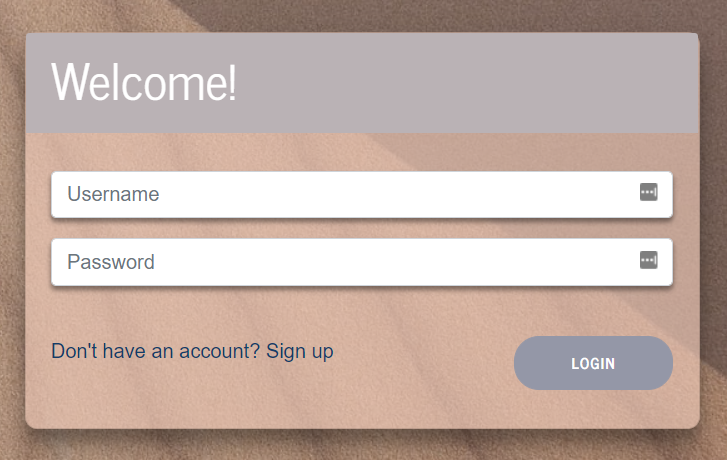
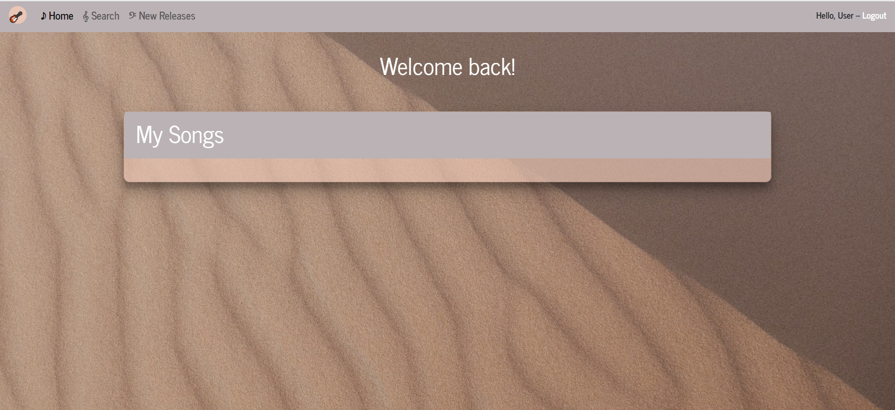

# jamEZ

 

 

 
 

 

 

## Table of Contents
* [Description](#description)
* [Installation](#installation)
* [Features](#features)
* [How to Use](#how-to-use)
* [Technologies Used](#technologies-used)
* [Application Demo](#application-demo)
* [Deployed Application](#deployed-application)
* [License](#license)
* [Contact Us](#contact-us)

## Description

jamEZ is an application that allows users to browse artists and songs, add songs to a list, preview songs, view songs on Spotify, and browse newly-released songs. After creating an account and once logged into the application, users will be able to perform all of the above activities.

## Installation

This application is deployed on [Heroku](https://jamez.herokuapp.com/) for any curious users who would like to jam out in their free time, during the daily grind, or whenever else they feel so inclined!

## Features

* Create an account
* Search for songs and artists
* Browse new releases
* Create playlists
* View songs and artists on Spotify
* Preview songs
* Log out

## How to Use

After creating an account and logging into jamEZ, the user will be able to access all of the application's functionality. The actions that users can perform are as follows:

* Search for songs:

 * To search for a song, click on the Search option in the navigation bar. Once there, select Tracks from the dropdown and enter a song name in the text field, then click Search.
 * Once the results populate, you will be able to view the top 20 results (or fewer depending on your search terms). You will also have the ability to listen to the first 30 seconds of each song, add a song to a playlist, and view the song on Spotify.

* Search for artists:

  * To search for an artist, click on the Search option in the navigation bar. Once there, select Artist from the dropdown and enter an artist's name in the text field, then click Search.
  * After the results appear, you will be able to view a maximum of 20 artists. You will also have the ability to view them on Spotify and view their top songs.

* Create a playlist:

  * On the home page is a box that is labeled My Songs. To add songs to that box:
    * Click on Search in the navigation bar
    * Select Tracks from the search dropdown and enter a song name in the field, then select Search
    * Once a list of songs appear, find the song that you would like to add, then choose the Add to Playlist option
    * After doing so and returning to the home page, the song that you selected will appear in the My Songs box

* Browse New Releases:

  * In the navigation bar is the option New Releases. Upon clicking on it, you will be able to view the top 20 new releases
  * Each new release listing offers the option to view the songs on the album, add the each song to the My Songs box, as well as view the release on Spotify

## Technologies Used
 

| Back End   | Front End            |
| ---------- | -------------------- |
| Node JS    | React-Bootstrap      |
| Express.js | React                |
| Mongoose   | CSS                  |
| MongoDB    | HTML5                |
| Spotify API| JSX                  |
|            | React-H5-Audio-Player|
|            |                      |

## Application Demo
After following the information in the [Installation](#installation) section users will be greated with an opening page that looks like this:

------------------------------------------------------

In addition to being deployed on Heroku, here is a GIF showing the app's full functionality:

## License

## Contact Us

* Jarrod Bataille

  * E-mail: jtbataille@gmail.com
  * GitHub: https://github.com/jtbataille
  * Portfolio: https://jtbataille.github.io/
  

* Masiel Bautista
   
   * E-mail: masiel3055@gmail.com
   * GitHub: https://github.com/masielb
   * Portfolio: https://masielb.github.io/

* Kasey Jones
   
   * E-mail: joneskm72@gmail.com
   * GitHub: https://github.com/joneskm72
   * Portfolio: https://joneskm72.github.io/portfolio/
   
* Vani Kalaparthy
   
   * E-mail: kalaparthy.vani@gmail.com
   * GitHub: https://github.com/vkalaparthy
   * Portfolio: https://vkalaparthy.github.io/
   
* Curran Miller
   
   * E-mail: curransmiller@gmail.com
   * GitHub: https://github.com/CurranSMiller
   * Portfolio: https://curransmiller.github.io/